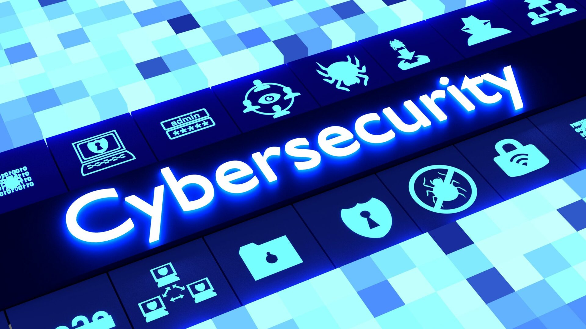

# Cybersecurity Studies

  

Welcome to the Cybersecurity Studies Repository! Here you will find a wide collection of materials related to many areas of this exciting and ever-evolving field. Our goal is to provide quality educational resources to help you learn and improve your information security skills, covering everything from basics to advanced topics.

## Repository Structure

The repository is organized into thematic folders to facilitate navigation and access to specific contents:

1. **basic**: In this folder, you'll find fundamental information about cybersecurity, perfect for beginners. Explore essential concepts, terminology, and basic principles of information security.

2. **linux**: Here, you will find materials related to the Linux operating system, focusing on security, administration and configuration aspects. Includes information about Kali Linux, a popular distribution for penetration testing and security audits.

3. **network**: The network folder covers studies on networks, protocols, architecture, as well as vulnerabilities and mitigation techniques. Dive into network security and understand how to protect important assets.

4. **programming**: This folder offers programming content related to cybersecurity. Learn commonly used languages ​​in the field, such as Python, C, .NET, Shell and PHP, which play a crucial role in many security activities.

5. **tools**: The tools section is exclusively dedicated to resources used by pentesters, vulnerability testing professionals and security experts. Discover a variety of useful tools for assessing and ensuring the security of systems and networks.

6. **web**: In this folder you will find topics related to web hacking. Learn about common vulnerabilities in web applications, how to exploit and protect against them.

## Disclaimer

This repository is intended for educational and learning purposes in cybersecurity only. It is important to remember that improper use of the knowledge gained here may violate local laws and regulations. The authors and contributors are not responsible for any misuse or illegal use of the material available here.

## License

[MIT](https://choosealicense.com/licenses/mit/)

## Final considerations

Thank you for being part of this project and we hope you find value and useful knowledge in our materials. Cybersecurity is an exciting and challenging field, and we're here to support your learning journey. Be ethical, responsible and continue to seek to improve your skills to make the digital world safer.

Have fun learning!

Sincerely, Pedro/boloto1979.
